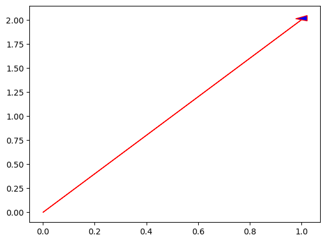
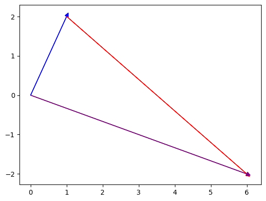
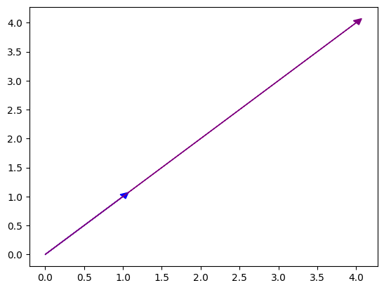

# Vectors

## Introduction

In linear algebra, a _vector_ is an ordered list of numbers. Vectors have two key characteristics:

- _Dimensionality_: The number of numbers in the vectors

- _Orientation_: Whether the vector is in column orientation (tall) or row orientation (long).

$\mathbb R^N$ refers to a dimensionality of $N$ for a vector made up of real numbers.

<div class="grid" markdown>

$$
\mathbf x = \begin{bmatrix}1 \\ 4 \\ 5 \\ 6\end{bmatrix}
$$

<div markdown style="display: flex; align-items: center; justify-content: center;">
$$
\mathbf y = \begin{bmatrix}.3 & -7\end{bmatrix}
$$
</div>

<div style="text-align: center;" markdown>a $4\text{D}$ column vector</div>

<div style="text-align: center;" markdown>a $2\text{D}$ row vector</div>

</div>

??? tip "Does orientation matter?"

    Is $\mathbf x$ same as $\mathbf x^T$? Is it same as an orientationless 1D array?

    Only ever in abstract math. In Python it will only matter in so far as to ensure nothing breaks.


Linear algebra convention is to assume that vector are in column orientation unless otherwise specified. Row vector are written as $\mathbf w^T$.

## Representation in Python

=== "as list"

    Python's in-build `list` type. Simple but most linear algebra operations won't work on it.

    ```python
    asList = [1, 2, 3]
    ```

=== "as array"

    an _orientationless_ array, meaning it is neither a row nor a column vector, but simply as 1D list of numbers in NumPy.

    ```python
    asArray = np.array([1, 2, 3])
    print(asArray.shape) // (3,)
    ```

=== "as row"

    $$
    \text{row} = \begin{bmatrix}1 & 2 & 3\end{bmatrix}
    $$

    ```python
    rowVec = np.array([[1, 2, 3]])
    print(asArray.shape) // (1, 3)
    ```

=== "as column"

    $$
    \text{col} = \begin{bmatrix}1 \\ 2 \\ 3\end{bmatrix}
    $$

    ```python
    colVec = np.array([[1], [2], [3]])
           = np.array([[1, 2, 3]]).T // or
    print(asArray.shape) // (3, 1)
    ```

Dimensions are always listed as $(\text{rows}, \text{columns})$.


## Geometry of Vectors

A vector like $[1, 2]$ may be natural to think as just a coordinate $(1, 2)$ in $\mathbb R^2$. But vector and coordinate are consistent with each other when the vector starts at the origin. That is:

$$
(0, 0) \rightarrow (1, 2)
$$

<div markdown class="grid">

```python
import numpy as np
import matplotlib.pyplot as plt

origin = np.array([0, 0])
vector = np.array([1, 2])

# Setup the plot area
fix, ax = plt.subplots()

# Draw the vector arrow
ax.arrow(origin[0], 
         origin[1], 
         vector[0], 
         vector[1],
         head_width=0.05, 
         head_length=0.05, 
         fc='blue', 
         ec='red')
```



</div>

## Operations on Vectors

### Adding two vectors

<div class="grid" markdown>

<div markdown>
```python linenums="1"
a = np.array([4, 5, 6])
b = np.array([10, 20, 30])
print(a + b) // [14 25 36]
```
</div>

<div markdown>
$$
\begin{bmatrix}4 \\ 5 \\ 6\end{bmatrix} + \begin{bmatrix}10 \\ 20 \\ 30\end{bmatrix} = \begin{bmatrix}14 \\ 25 \\ 36\end{bmatrix}
$$

We are showing it as a column vector, but notice that both $a$ and $b$ are orientationless.

</div>

</div>

<br><br>
what happens when orientation comes into picture?

<div class="grid" markdown>

<div markdown>
```python linenums="1"
a = np.array([[4, 5, 6]])
b = np.array([[10, 20, 30]]).T
print(a + b)
```

```
[[14 15 16]
 [24 25 26]
 [34 35 36]]
```

</div>

<div markdown>
$$
\begin{bmatrix}4 & 5 & 6\end{bmatrix} + \begin{bmatrix}10 \\ 20 \\ 30\end{bmatrix} = \begin{bmatrix}14 & 15 & 16 \\ 24 & 25 & 26 \\ 34 & 35 & 36\end{bmatrix}
$$

Python is implementing an operation called _broadcasting_.
</div>

</div>

#### Geometry of Vector Addition

<div markdown class="grid">

<div markdown>
```python
import numpy as np
import matplotlib.pyplot as plt

v = np.array([1, 2])
w = np.array([5, -4])
vector = v + w

fix, ax = plt.subplots()

ax.arrow(0, 0, v[0], v[1],
         head_width=0.1,
         head_length=0.1,
         fc='blue', ec='blue')

ax.arrow(1, 2, w[0], w[1],
         head_width=0.1,
         head_length=0.1,
         fc='red', ec='red')

ax.arrow(0, 0, vector[0], vector[1],
         head_width=0.1,
         head_length=0.1
```
</div>

<div markdown>

</div>

</div>

To add two vectors geometrically, place the vectors such that the tail of one vector is at the head of the other vector. The summed vector traverses from the tail of the first vector to head of the second.

### Vector-Scalar Multiplication

A _scalar_ in linear algebra is a number on its own, not embedded in a vector or matrix. Multiplication by scalar is straightforward.

<div markdown class="grid">

<div markdown>
```python linenums="1"
w = np.array([9, 4, 1])
print(4 * w) // [36 16  4]
```
</div>

<div markdown>
$$
\lambda = 4, \mathbf w = \begin{bmatrix}9 \\ 4 \\ 1\end{bmatrix}, \lambda \mathbf w = \begin{bmatrix}36 \\ 16 \\ 4\end{bmatrix}
$$
</div>

</div>

#### Geometry of Vector-Scalar Multiplication

The term _scalar_ comes from the geometric interpretation, i.e. "scaling" of the vector by the given factor.

<div markdown class="grid">

<div markdown>
```python
import numpy as np
import matplotlib.pyplot as plt

w = np.array([1, 1])
lw = 4 * w

fix, ax = plt.subplots()

ax.arrow(0, 0, w[0], w[1],
         head_width=0.1,
         head_length=0.1,
         fc='blue', ec='blue')

ax.arrow(0, 0, lw[0], lw[1],
         head_width=0.1,
         head_length=0.1,
         fc='purple', ec='purple')
```
</div>

<div markdown>

</div>

</div>
